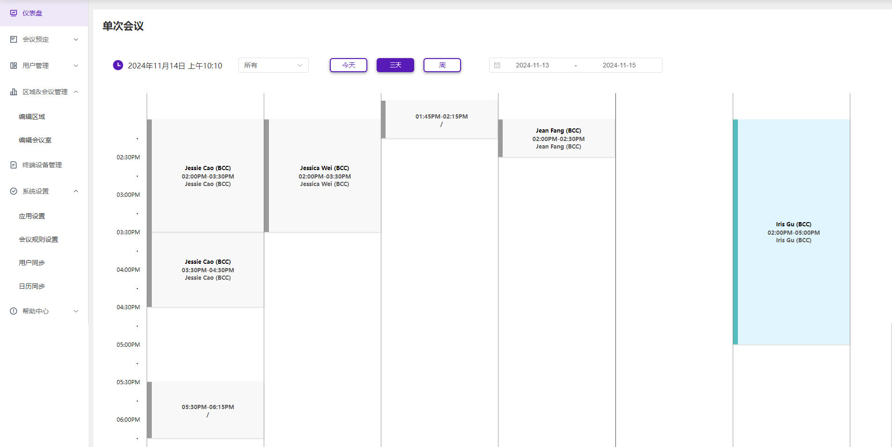

# BCC MRBS


A conference room reservation system developed based on PHP, with a web management backend and a conference room tablet display.




For details on the display project, please see [mrbs-display](https://github.com/synaric-y/mrbs-display)。

# Features

- Area/Meeting/Room Management
- Tablet screen displays conference room status and reservation information
- Sync Calendar with Microsoft Exchange, extensible third-party Calendar support
- Import users and groups from Active Directory
- I18n support, Chinese/English/Korean...
- Booking from tablet/webpage/Wxwork
- Remote Update tablet app

# Install

## Environment And Dependencies

**Environment**

- PHP 7.2 above
- MySQL 5.5.3 above or PostgreSQL 8.2 above
- Apache or other web service

**Dependencies**

Please install the following dependencies in order.

- php-iconv
- php-soap
- php-ldap

## Steps

1.Install composer dependencies：

```
composer install
```

2.Import initialization SQL


MySQL or PostgreSQL creates a database named ```mrbs``` and imports the data.

The imported SQL file is located in ```./sql/tables.*.sql```.

3.Configuration

The configuration file ```config.inc.php``` needs to be created in the project ```/web``` directory. The template of the configuration file can be obtained from ```./web/config.inc.php-sample``` Copy.

Necessary configuration items:

```php
// You must set the timezone to a valid value, a list of which can be found at
// https://www.php.net/manual/zh/timezones.php
$timezone = "Asia/Shanghai";

// Select your database system.
$dbsys = "mysql";

// Then define your database connection parameters. Set the values for:
$db_host = "your_host";
$db_database = "mrbs";
$db_login = "your_user";
$db_password = 'your_password';
$db_tbl_prefix = "mrbs_";
```

For more information please refer to [INSTALL](doc/INSTALL)。

For more configuration, please refer to```systemdefaults.inc.php```。

> Note: Do not modify systemdefaults.inc.php before you are familiar with the project. It can be used as a backup of the default configuration to prevent failure to roll back.
> If you need to modify the configuration, the configuration item with the same name in config.inc.php has the highest reading priority, so change the configuration that needs to be modified from
> Copy systemdefaults.inc.php to config.inc.php and then modify it.


## Deployment

Package ```web``` and ```image``` directories to the Web server.

(Optional) Start a third-party Calendar scheduled synchronization task:

```
nohup php /path-to-your-project/web/task/sync_tpcs.php > /dev/null 2>&1 &
```

(Optional) Start an AD synchronization task within crontab:

```
# add this line
0 1 * * * php /www/wwwroot/172.16.89.91/web/task/sync_ad.php
```

# Support


## TODO

- More templates
- Area-level multiple data source management
- Multi-language mixed display on tablet
